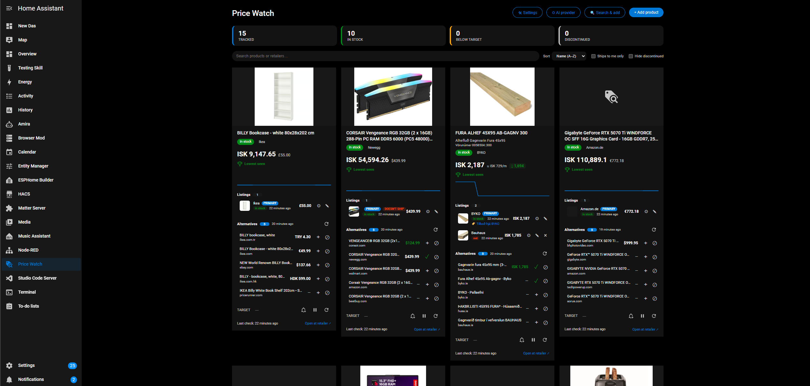

<p align="center">
  
</p>

# Price Watch for Home Assistant

[](https://github.com/hacs/integration)
[](https://github.com/TheIcelandicguy/price_watch/releases)
[](LICENSE)

> Track product prices across the web from inside Home Assistant. Paste a URL, get sensors and a price history. Works **free** on most major retailers (no API key) — with an optional AI fallback for the tricky ones.

<p align="center">
  
</p>

> [!NOTE]
> **This is a beta looking for testers.** It works well on a wide range of retailers, but the web is messy — some shops block automated requests or hide prices behind "add to cart". Bug reports, retailer reports (works / doesn't work), and ideas are very welcome — please [open an issue](https://github.com/TheIcelandicguy/price_watch/issues).

## What it does

- **Track any product page** — paste a URL and get a device with price, lowest/highest seen, target diff, and stock sensors, plus a rolling price history.
- **Free by default** — reads price/stock from a page's Schema.org / Open Graph data, which most major retailers expose. No account, no key, no cost.
- **A dedicated sidebar panel** — add, search, compare and manage everything from one Price Watch screen (no YAML, no dashboard wiring).
- **Compare across retailers** — track the same product at several shops as separate "listings" under one product, and convert every price into your home currency.
- **Find it cheaper** — a built-in discovery search ("Search & add") looks the product up across the web, prices the results it can, and lets you add any of them with one click.
- **Region-aware** — flags listings that won't ship to your country and can hide them.
- **Smart alerts** — fire Home Assistant events on price drops, target hits, new lows, restocks, and "now on sale".

## Extraction modes

Pick per install (changeable anytime in the panel's ⚙ settings):

| Mode | Needs | Good for |
|---|---|---|
| **Free** (default) | nothing | Any site with Schema.org `Product` / Open Graph price data — most major retailers. |
| **Custom parser** | a CSS selector / regex you point at the price | Sites that show the price but don't expose structured data (also free). |
| **AI** — Anthropic (Claude) or any OpenAI-compatible endpoint (incl. **Ollama**, LM Studio, Groq, OpenRouter) | a key, or a local model | A universal fallback for pages free mode can't read, and smarter "find alternatives" discovery. |

You can run **fully free**, or add AI only as a fallback for the pages that need it.

## Installation

### HACS (custom repository)

1. HACS → ⋮ (top right) → **Custom repositories**
2. Repository: `https://github.com/TheIcelandicguy/price_watch` — Category: **Integration**
3. Install **Price Watch**, then **restart Home Assistant**
4. Settings → Devices & Services → **Add Integration** → **Price Watch**
5. Choose a mode (Free is fine to start) and finish. A **Price Watch** item appears in the sidebar.

### Manual

Copy `custom_components/price_watch/` into your HA `config/custom_components/` directory and restart.

**Minimum Home Assistant version:** 2024.10.0

## Quick start

1. Open **Price Watch** in the sidebar.
2. **Add product** → paste a product URL (or use **Search & add** to find one).
3. The page is fetched and a preview appears; confirm to start tracking.
4. Set a **target price** to get notified when it drops below.

To compare retailers, open a product's card and **Add listing** (another shop's URL for the same item), or add one straight from a **Search & add** result.

## Sensors per product

| Entity | Description |
|---|---|
| `sensor.<slug>_price` | Current price (main sensor) |
| `sensor.<slug>_price_local` | Price converted to your home currency |
| `sensor.<slug>_lowest_seen` | Lowest price since tracking began |
| `sensor.<slug>_highest_seen` | Highest price since tracking began |
| `sensor.<slug>_target_diff` | Current minus target (negative = at/below target) |
| `sensor.<slug>_stock_count` | Units in stock, where the retailer exposes it |
| `binary_sensor.<slug>_in_stock` | Stock availability |
| `binary_sensor.<slug>_discontinued` | Product looks discontinued |
| `image.<slug>_photo` | Product photo |
| `button.<slug>_refresh_now` | Refresh this product now |

The price sensor carries useful attributes: `product_url`, `image_url`, `retailer`, `currency`, `last_check`, `price_history`, all-time low / "is at low", typical price, and (where available) a per-unit price (e.g. kr/m) and per-store stock.

## Events

Build automations on these `event` triggers:

| Event | Fires when |
|---|---|
| `price_watch_price_drop` | Price decreased |
| `price_watch_target_hit` | Price reached/crossed your target |
| `price_watch_new_low` | New all-time low |
| `price_watch_back_in_stock` | Came back in stock |
| `price_watch_discount` | The retailer's own sale/strikethrough appeared |
| `price_watch_discontinued` | The product looks discontinued |

```yaml
alias: Notify on target hit
triggers:
  - trigger: event
    event_type: price_watch_target_hit
actions:
  - action: notify.notify
    data:
      title: "💰 Target hit: {{ trigger.event.data.title }}"
      message: "{{ trigger.event.data.price }} {{ trigger.event.data.currency }} (target {{ trigger.event.data.target }})"
      data:
        url: "{{ trigger.event.data.url }}"
```

Event data includes: `entry_id`, `listing_id`, `title`, `url`, `retailer`, `price`, `currency`, `previous_price`, `target`, `image_url` (plus `original_price` / `discount_percent` on `price_watch_discount`).

The panel also has a 🔔 dialog that writes these automations for you.

## Services

| Service | Purpose |
|---|---|
| `price_watch.track_product` | Create a tracked product from a URL |
| `price_watch.add_listing` / `remove_listing` | Add/remove a retailer listing under a product |
| `price_watch.edit_listing` | Set a custom parser, cookies, currency, unit price, or swap a listing's URL |
| `price_watch.set_target` | Update the target price |
| `price_watch.set_variant` | Pick a variant (size/length) on supported pages |
| `price_watch.set_paused` | Pause/resume polling (keeps the last price) |
| `price_watch.find_alternatives` | Run a discovery search for one or all products |
| `price_watch.refresh_now` | Force an immediate refresh |
| `price_watch.reset_history` | Wipe a product's price history |

## Cost

Free mode and custom parsers cost **nothing**. If you add an Anthropic key, typical usage is roughly **$0.50–$2/month** for ~10 products (content-hash skipping + prompt caching keep calls down, and there are daily/monthly budget caps). A local Ollama model is free.

> [!IMPORTANT]
> An API key you enter is stored in Home Assistant's `.storage` in plain text (like other HA integrations). On a trusted home network that's normal; just be aware of it. A local Ollama endpoint avoids storing any secret.

## Known limitations

Honest expectations for testers:

- **Some big retailers actively block bots** (e.g. Amazon, Best Buy, Home Depot, Lowe's, MediaMarkt sometimes). Price Watch impersonates a real browser and gets many of them, but not all — and never guaranteed, since their defenses change. Where a site loads but hides structured data, a one-click **custom price selector** in the panel usually fixes it.
- **"See price in cart" / MAP pricing** (some US retailers) can't be read — the price genuinely isn't on the page.
- **Discovery quality depends on the search source.** AI search finds real product pages; the free DuckDuckGo path is weaker for niche items. The integration filters out review/category pages either way.

## Development

```bash
# Backend tests
pip install -r requirements_test.txt
pytest tests/

# Panel (Lit + Rollup)
cd panel && npm install && npm run build   # outputs custom_components/price_watch/frontend/price-watch-panel.js
```

CI runs hassfest, HACS validation, pytest (3.12 + 3.13), and ruff on every push.

## License

MIT — see [LICENSE](LICENSE).
